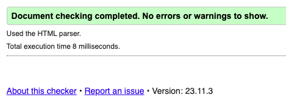
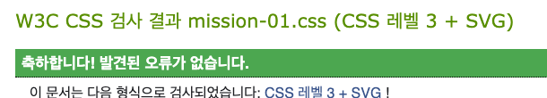

# 과제 첫 인상

해당 UI를 봤을 때 심플한 레이아웃이라 아주 어렵진 않겠다는 생각이 들었다. 하지만 카드 배치나 구매하기 버튼의 호버 효과 부분 등이 까다로울 것이 예상됐다.

# 전체 구조 설정

1.  제공받은 UI에 크게 3개의 카드가 있는데 위치를 잡는 것이 역시나 쉽지 않았다. 카드 배치를 위해 position과 float를
    활용해 보고자 했으나 실패하고 Flexbox를 사용하기로 결정했다.
2.  전체 3카드, 하위 2카드, 그리고 첫 번째 꿀생강차 카드의 로고와 제목 등 다양한 그룹핑이 필요로 했다.
3.  하위의 핸드크림과 보리차 카드들은
    `display: flex;
flex-direction: column;
align-items: center;
justify-content: center; `
    이 코드 형태로 비교적 빠르게 각각 로고, 제목 그리고 제품 이미지를 배치 할 수 있었다. 요소들을 수직 중앙 정렬된 레이아웃으로 만든 것이다.

# 중간 이슈

카드들의 버튼 위치 이슈가 있었다. 개발자 도구를 계속 켜놓고 작업하느라 발견하지 못했던 문제가 inspect 창을 껐을 때 확인된 것이다.
모든 버튼의 위치가 엉뚱한 곳에 가 있어 정말 당황했다. 한마디로 반응형 웹 디자인을 염두에 두지 않고 웹 브라우저 창의 크기를 고정해 놓은 채 작업한 것이다. 결론적으로는 각 버튼들의 부모 요소에 position: relative;를 적용해서 해결 가능한 문제였다. 앞으로 작업 시에는 이런 황당한 실수가 없도록 반드시 웹 브라우저 창 사이즈 변화에 따른 결과를 확인해야겠다.

# 가장 큰 챌린지-버튼의 애니메이션 효과

두가지 방법으로 시도.
버튼의 호버 효과를 구상할 때 두 가지 방식이 떠올랐다. 첫번째는 background-image를 활용한 방식이었고, 이것은 비교적 쉽게 하단의 두 카드들에 적용시켰다. 하지만 이미지 간의 전환이 매끄럽지는 않았다.
두번째는 버튼에 이미지를 넣지 않고 링크 자체를 버튼으로 활용하는 방식이었다. 버튼이 옆으로 슬라이드 되는 형태로 전환은 매끄러웠다.
하지만 버튼 안의 '구매하기' 텍스트를 다루는 것이 매우 까다로웠다. 결국 호버 효과 작동 전에 버튼에서 텍스트를 사라지게 하는 것은 실패했다.
가능한 방법이 있는 지 좀 더 연구 해 봐야겠다.

# 해결되지 않는 의문

`.button-hTea {
font: 100 20px;
text-decoration: none; 
}`

font 속성이 적용되지 않는 점,
텍스트에 자동으로 밑줄이 적용되어있는 점.

# 해결해야할 문제

1. honeyGtea(꿀생강차 이미지)의 위치설정이 불완전하다. 오른쪽으로 더 이동시키고 싶으나, 이미지에 직접 패딩이나 마진 적용시 왼쪽의 로고와 텍스트 묶음이 동시에 움직인다. honeyGtea의 개별적 위치 이동이 가능하게 만들어야 한다.

2. 꿀생강차 구매 버튼에서 '구매하기'글자가 호버 효과 시에 나타나도록 바꿔야 한다.

# 새롭게 발견한 사실

button-hTea(꿀생강차 버튼)의 transition 방향이 버튼의 위치에 따라 자동으로 달라진다. 버튼이 처음에 랜덤 배치되었을 때 왼쪽으로 슬라이드되는 효과가 나타나서, transform-origin: left; 적용을 통해 문제를 해결 하려고 했다.
그러나 전혀 적용이 되지 않아 포기한 뒤, 버튼의 위치를 카드 왼쪽 하단으로 배치했더니 오른쪽으로 정상 작동했다. 테스트를 해보니 버튼이 카드의 중심에 있을 때는 양쪽으로 넓어지는 등 위치에 따라 호버 효과 방식이 자동으로 달라짐을 확인했다. 무슨 원리인지 그리고 원하는 방식으로 바꿀 수 있는 방법이 있는지는 추가적으로 확인해 봐야한다.

# 웹 접근성을 높이기 위한 노력

1. 스크린 리더가 의미있는 순서로 읽을 수 있도록 마크업 순서를 정했다.
2. img 요소에 적절한 alt(대체 택스트)를 제공했다.
3. aria-label 제공을 통해 구매 버튼에 대한 접근성을 높였다.
4. tabindex 속성을 사용해 탭으로 웹 페이지 요소 식별이 가능하게 했다.
5. 포커스 스타일링으로 상호작용이 크게 일어나는 링크 요소에 대한 접근성을 높였다.

# 추가적으로 시도해보고 싶은 부분

1. 각 카드의 제목에 해당하는 글을 무엇으로 마크업하는 것이 가장 적절한 지에 대한 고민이 있었다. 웹 접근성을 고려해 페이지의 구조를 조금이라도 명확히 하고자 heading으로 마크업을 했다. 하지만 해당 UI의 디자인 레이아웃 특성 상, 동일 계층의 제목이 3개인 점이 ul(unordered list)태그로도 마크업이 가능할 것으로 보인다. ul로도 마크업을 해 보고 싶다.

2. 현재는 카드 위 호버 상태에서 카드 border의 색상이 전환된다. 하지만 그에 더해 버튼의 색도 동시에 변하는 호버 효과를 주고 싶었으나 방법을 찾지 못했다. 현재는 버튼에 직접 마우스를 올려야 버튼의 색과 형태가 변하는 호버 효과까지 구현했다.

# 과제 소회

첫 과제인 만큼 많이 어설펐고 아쉬움이 큰 것 같다. 먼저 과제를 모두 끝낸 후 리드미를 작성한 점이 그렇다. 과제를 수행하며 겪었던 시행착오들 중 많은 부분을 놓치고 결과 위주로 작성하게 되었다. 커밋을 하는 것도 익숙치 않아 적절하게 해 놓지 못한 탓도 있다. 여러 시도와 실패의 과정을 잘 남겨 놓을 수 있게 다음부턴 커밋과 리드미 작성에 좀 더 신경 쓸 것이다. 또한 이번에 나를 놀래켰던 반응형 이슈도 꼭 챙겨야겠다.
결과적으론 이번 과제를 하면서 지난 2주 간 html, css를 배우며 미처 정리되지 않았던 부분들이 머릿속에서 개념이 보다 선명해진 듯하다.

# html, css 검사기 결과

html, css 파일 모두 유효성 검사 통과.
